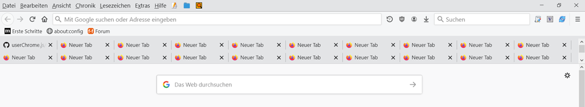

### CSS Codes für Mehrzeilige Tableiste und Änderung der Reihenfolge der Leisten     

Es stehen **4** verschiedenen CSS Codes zur Verfügung. Alle **4** Codes, ermöglichen eine Mehrzeilige Tableiste.     
**2** Css Codes verschieben die Tableiste zusätzlich unter die Adressleiste - bzw. Lesezeichenleiste.    
Verwendung mit und ohne Titelleiste möglich. In CSS Code **2** und **4** ist die Anzahl der Tabzeilen auf **5** begrenzt.    
Bei mehr Zeilen wird eine Scrollbar eingeblendet. Die Anzahl der Zeilen kann im CSS Code angepasst werden.    

- **01-Mehrzeilige-Tableiste.css Tabs Oben + Mehrzeilige Tableiste**      

- **02-Mehrzeilige-Tableiste.css Tabs Oben + Mehrzeilige Tableiste + verschiedene Anpassungen +**    
     **Tabzeilen Anzahlbegrenzung. Standard ist 5 Zeilen, kann in Zeile 16 geändert werden.**    
 
- **03-Mehrzeilige-Tableiste.css Tabs unter Adress -bzw. Lesezeichenleiste + Mehrzeilige Tableiste**   

- **04-Mehrzeilige-Tableiste.css Tabs unter Adress -bzw. Lesezeichenleiste + Mehrzeilige Tableiste +**     
     **Anpassungen + Tabzeilen Anzahlbegrenzung. Standard ist 5 Zeilen, kann in Zeile 34 geändert werden.**    

Css Code **05-Mehrzeilige-Tableiste.css** ist eine modifizierte Version von CSS Code **04-Mehrzeilige-Tableiste.css**    
mit fixierter Tabbreite, Anpassung verschiedener Abstände der Leisten und Tabzeilenbegrenzug auf **2**    
Bei mehr als **2** Tabreihen, wird dann eine Scrollbar angezeigt.   
   
### Mit CSS Code 1-2 sieht es so aus:

Tabs oben mehrzeilige Tableiste
 
 
 

Tabs oben, mehrzeilige Tableiste, Tabbreite auf 100px fixiert.    
Schließenkreuz nur bei aktivem Tab sichtbar
 
 
 

Tabs oben, mehrzeilige Tableiste, Tabbreite auf 150px fixiiert.    
Schließenkreuz bei allen Tab sichtbar
 
 
 
### Mit CSS Code 3-5 sieht es dann ungefähr so aus:    

Tabs unten mehrzeilige Tableiste
 
 
 

Tabs unten, mehrzeilige Tableiste, Tabbreite auf 100px fixiert.    
Schließenkreuz nur bei aktivem Tab sichtbar
 
 
 

Tabs unten, mehrzeilige Tableiste, Tabbreite auf 150px fixiert.    
Schließenkreuz bei allen Tab sichtbar 
 
 
### Anpassen - fixieren der Tabbreite 

**Zum Anpassen - fixieren der Tabbreite**    
folgende Zeilen in gewünschten CSS Code einfügen und anpassen     

    tabs tab[fadein]:not([pinned]) {
		 min-width: 100px !important;/* Minimale Tabbreite  76px */
		 max-width: 100px !important;/* Maximale Tabbreite 225px */
    }
	
Wenn man bei beiden Werten den selben Wert angibt wird die **Tabbreite fixiert.**

