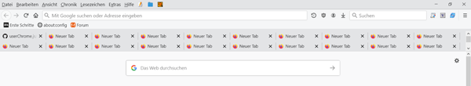

### CSS Codes für Mehrzeilige Tableiste und Änderung der Reihenfolge der Leisten

Es stehen **4** verschiedenen CSS Codes zur Verfügung. Alle **4** Codes, ermöglichen eine Mehrzeilige Tableiste.     
**2** Css Codes verschieben die Tableiste zusätzlich unter die Adressleiste - bzw. Lesezeichenleiste.    
Verwendung mit und ohne Titelleiste möglich. In CSS Code 2 und 4 ist die Anzahl der Tabzeilen auf 5 begrenzt.    
Bei mehr Zeilen wird eine Scrollbar eingeblendet. Die Anzahl kann im CSS Code angepasst werden.    

- **01-Mehrzeilige-Tableiste.css Tabs Oben + Mehrzeilige Tableiste**      

- **02-Mehrzeilige-Tableiste.css Tabs Oben + Mehrzeilige Tableiste + verschiedene Anpassungen**    
     **Tabzeilen Anzahlbegrenzung Standard ist 5, kann in Zeile 16 geändert werden.**    
 
- **03-Mehrzeilige-Tableiste.css Tabs unter Adress -bzw. Lesezeichenleiste + Mehrzeilige Tableiste**   

- **04-Mehrzeilige-Tableiste.css Tabs unter Adress -bzw. Lesezeichenleiste + Mehrzeilige Tableiste + Anpassungen**   
     **Tabzeilen Anzahlbegrenzung Standard ist 5, kann in Zeile 34 geändert werden.**    

## Anpassen - fixieren der Tabbreite 

**Zum Anpassen - fixieren der Tabbreite**    
folgende Zeilen in gewünschten CSS Code einfügen und anpassen     

    tabs tab[fadein]:not([pinned]) {
		 min-width: 100px !important;/* Minimale Tabbreite  76px */
		 max-width: 100px !important;/* Maximale Tabbreite 225px */
    }
	
Wenn man bei beiden Werten den selben Wert angibt wird die **Tabbreite fixiert.**

### Mit CSS Code 3-5 sieht es dann ungefähr so aus:    

Css Code5 ist eine modifizierte Version von CSS Code **4**
mit fixierter Tabbreite und Abpassung verschiedener Abstände.
